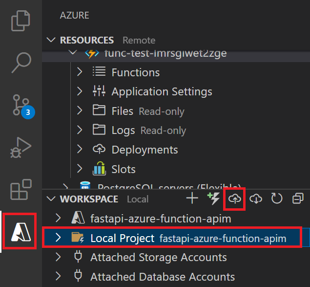

# Azure Function with APIM
This repository includes a simple HTTP API powered by FastAPI, made for demonstration purposes only. This API is designed to be deployed as a secured Azure Function with an API Management service in front.

## Prerequisites
You can develop and deploy a function app using either Visual Studio Code or the Azure CLI. Make sure you have the required prerequisites for your preferred environment:

* [Prerequisites for VS Code](https://docs.microsoft.com/azure/azure-functions/create-first-function-vs-code-python#configure-your-environment)
* Azure Tools extension has been installed in VS Code
* Azure Deployment enviroments has provisioned the environment

## QuickStart
1. Clone this [repo](https://github.com/luxu-ms/fastapi-azure-function-apim)

2. Use VSCode to open "fastapi-azure-function-apim"

3. Go to Azure Tools, in the WORKSPACE, select "local Project", click "upload" icon, select "Deploy to Function App..."

4. Click "fastapi-azure-function-apim" in the "folder to deploy" list, select the subscription, select the function app provisioned, click "Deploy"

## How to verify
* In Azure Portal, select the API management provisioned, click "APIs", click "Protected API Calls", click "Generate_Name", click "Test", click "Send". The response is 200 and contains name.
* In Postman, send the get request to "https://<api management name>.azure-api.net/api/generate_name".
>Note: If using Postman, in the header, add the key "Ocp-Apim-Subscription-Key" and its value. You can find the subscriptioin key in the test reqeust or create a new one from APIM's subscriptions.